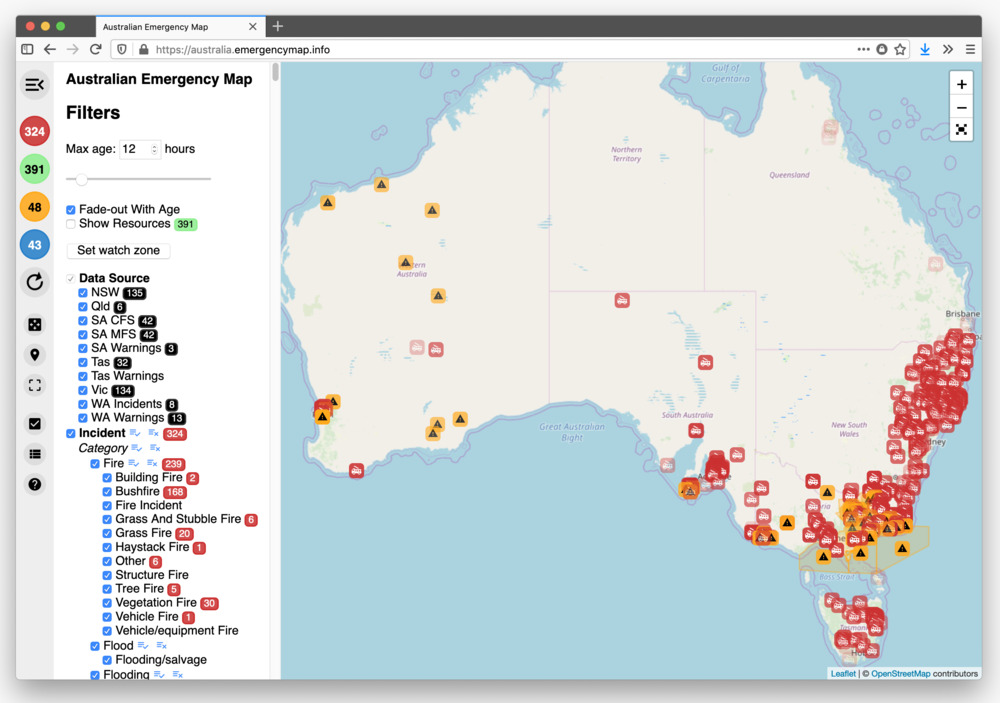

# Australian Emergency Map

https://australia.emergencymap.info

## Features

- Filter data by feed-type, categories and status.
- Fade-out map markers with age
- Automatic map zoom
- Automatic data fetch
- Counters for each category of incident and allocated resources
- Save and load selected filters as a cookie or URL
- Watch-zone bounding box

See [user guide](./public/user_guide/index.md) for more details.

## Tech

Proudly built with free, open-source software:

- <a href="http://leafletjs.com/">Leaflet</a>
- <a href="https://www.openstreetmap.org/about">OpenStreetMap</a>
- <a href="https://vuejs.org/">Vue.js</a>
- <a href="https://www.mozilla.org/en-US/firefox/">Firefox</a>

## Notice

THE SOFTWARE IS PROVIDED "AS IS", WITHOUT WARRANTY OF ANY KIND, EXPRESS OR
IMPLIED, INCLUDING BUT NOT LIMITED TO THE WARRANTIES OF MERCHANTABILITY,
FITNESS FOR A PARTICULAR PURPOSE AND NONINFRINGEMENT. IN NO EVENT SHALL THE
AUTHORS OR COPYRIGHT HOLDERS BE LIABLE FOR ANY CLAIM, DAMAGES OR OTHER
LIABILITY, WHETHER IN AN ACTION OF CONTRACT, TORT OR OTHERWISE, ARISING FROM,
OUT OF OR IN CONNECTION WITH THE SOFTWARE OR THE USE OR OTHER DEALINGS IN
THE SOFTWARE.
