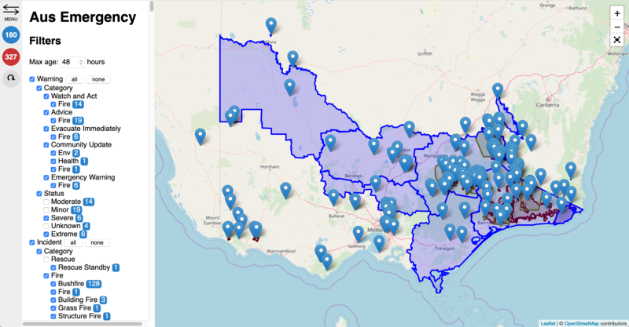

# Aus Emergency Map

A better data-filtering UI for the Vic Emergency data feed.

## Features

- Filter data by feed-type, category1, category2 and status.
- Automatic map zoom
- Automatic data fetch
- Blue: Count of incidents matching selected filters
- Red: Total count of resources (eg fire trucks) attending

## Tech

Proudly built with open-source software:

- <a href="http://leafletjs.com/">Leaflet</a>
- <a href="https://www.openstreetmap.org/about">OpenStreetMap</a>
- <a href="https://vuejs.org/">Vue.js</a>
- <a href="https://www.mozilla.org/en-US/firefox/">Firefox</a>
