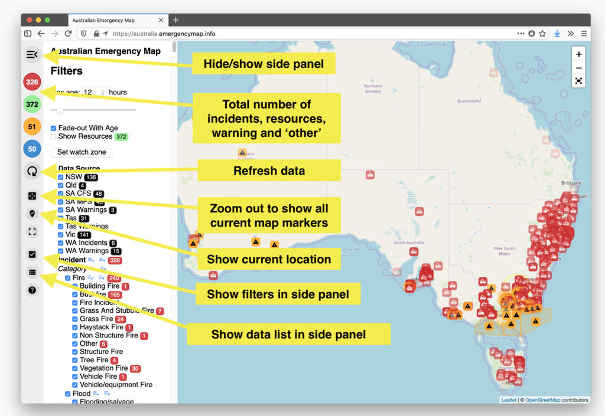
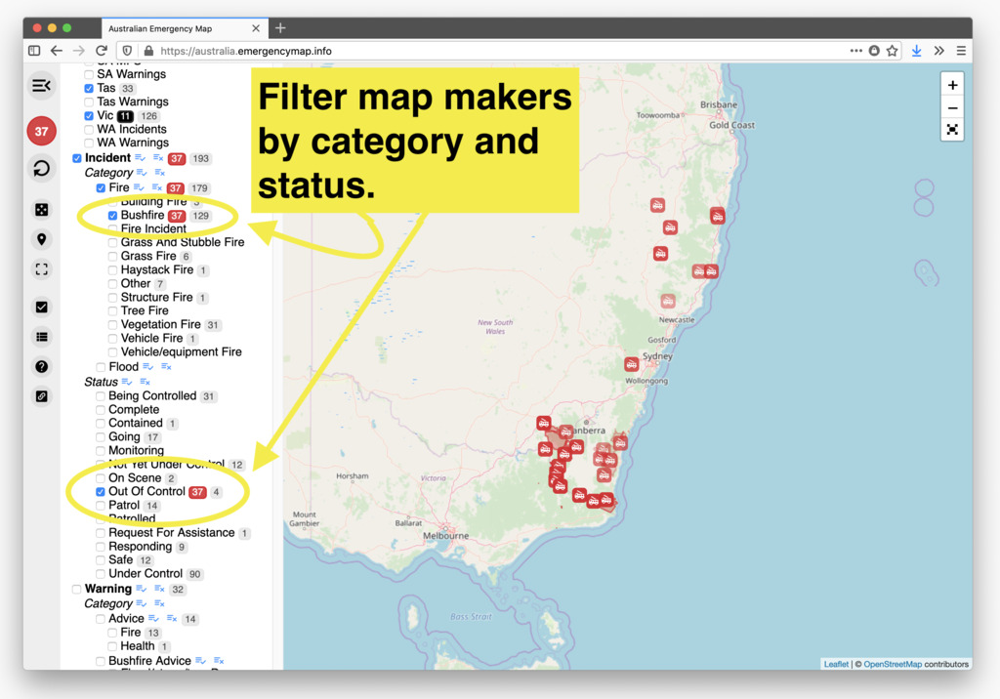
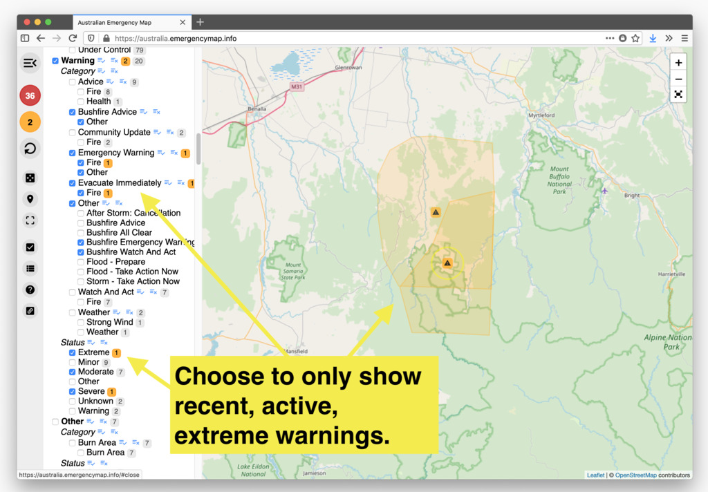
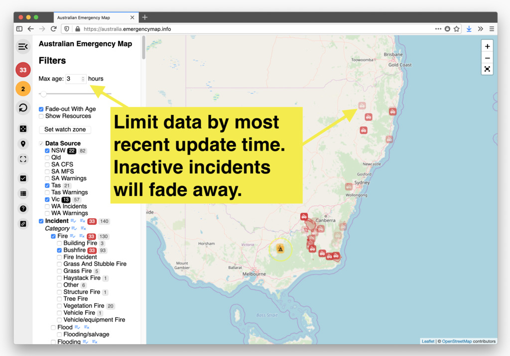
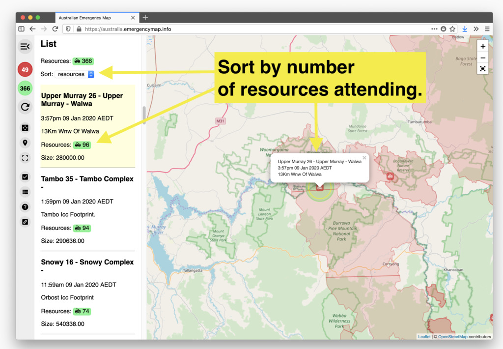
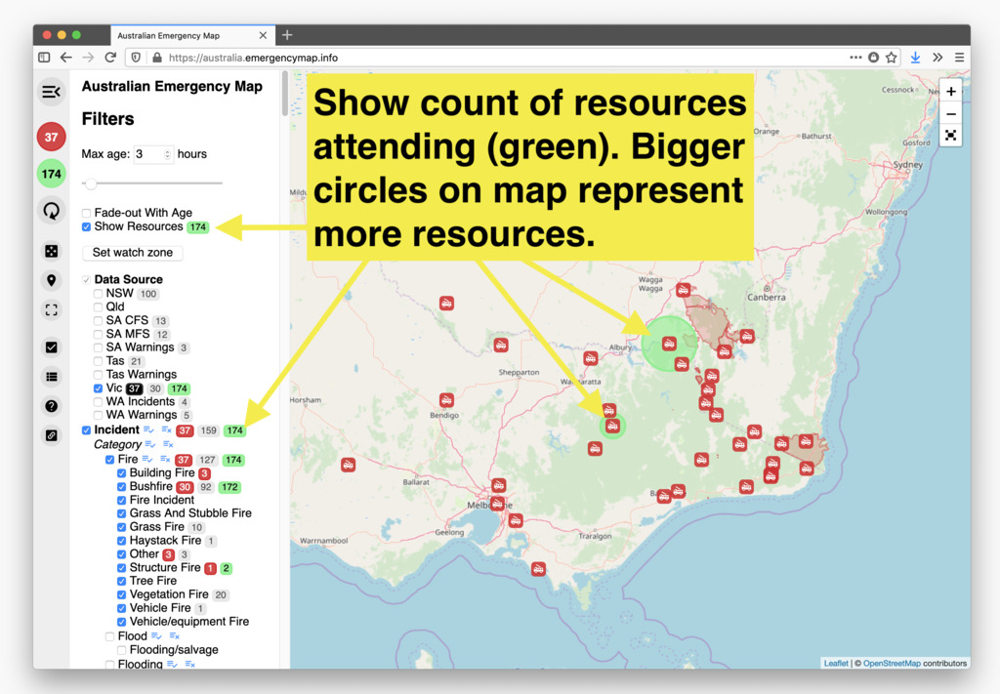
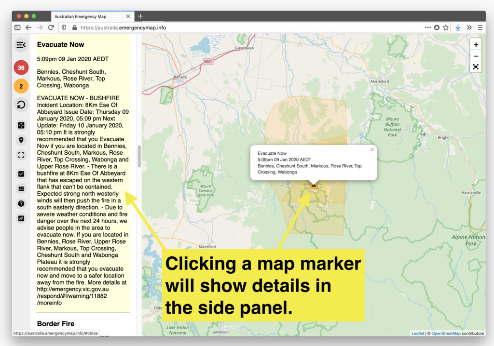
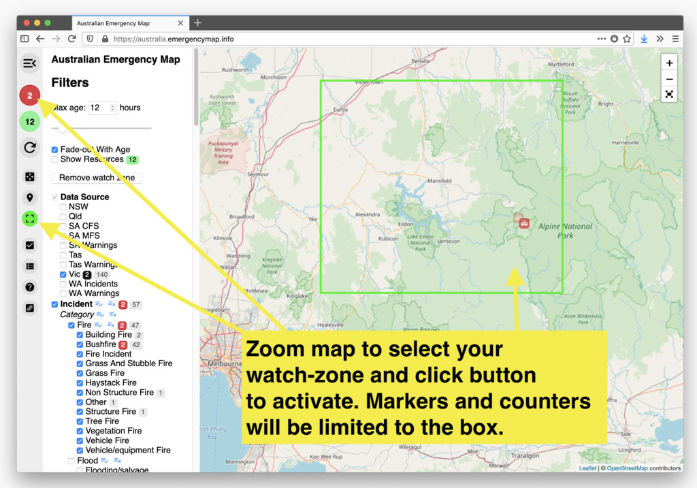

# Australian Emergency Map

## User Guide

## Demo Video

https://youtu.be/GPqtbzj_EWg

## Features

## Notice

This map is in no way officially affiliated with any emergency services, state government or data source.

Do not use this app as a warning or alert service. Use it only as an analysis tool for the raw data and for seeing a big-picture overview.

This is a non-commercial, volunteer project. <a href="https://github.com/reillybeacom/aus-emergency-map">Source code</a> is available and feedback or contributions welcome.

THE SOFTWARE IS PROVIDED "AS IS", WITHOUT WARRANTY OF ANY KIND, EXPRESS OR
IMPLIED, INCLUDING BUT NOT LIMITED TO THE WARRANTIES OF MERCHANTABILITY,
FITNESS FOR A PARTICULAR PURPOSE AND NONINFRINGEMENT. IN NO EVENT SHALL THE
AUTHORS OR COPYRIGHT HOLDERS BE LIABLE FOR ANY CLAIM, DAMAGES OR OTHER
LIABILITY, WHETHER IN AN ACTION OF CONTRACT, TORT OR OTHERWISE, ARISING FROM,
OUT OF OR IN CONNECTION WITH THE SOFTWARE OR THE USE OR OTHER DEALINGS IN
THE SOFTWARE.
